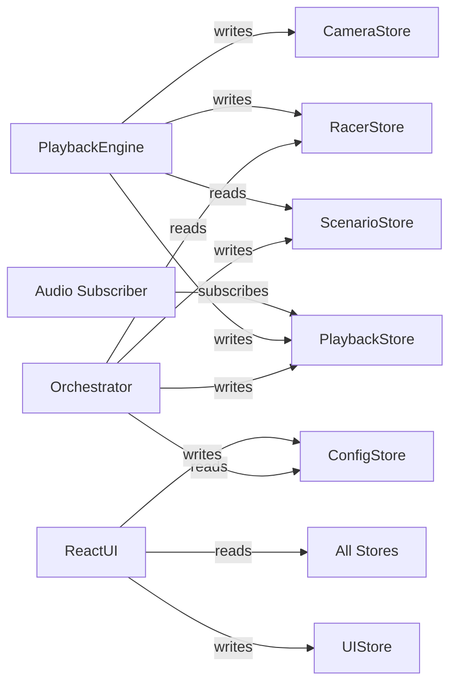

# Tech Lead Blueprint: Fun Racing Randomizer Game

> **Revision 2** — Updated for kebab-case filenames, Biome/Ultracite linting, entity-first Zustand stores, unified simulation↔render coordinate system, and community-defined event types.

---

## 1) Product Goal

Xây game đua xe vui nhộn chạy client-side với React 19 + TypeScript + Zustand + PixiJS.

Luồng cốt lõi:
1. User chọn danh sách racer/characters (mỗi dòng một tên hoặc chọn từ roster).
2. User chọn “event packs / obstacles” khả dụng (chỉ chọn loại event, chưa có timeline cụ thể).
3. Preview racers ngay trên canvas (idle) khi user gõ/chọn.
4. Nhấn Start → runtime sẽ:
   - Randomize **vận tốc động** cho từng racer (base speed + fluctuations).
   - Randomize/schedule **EventInstances** từ các event packs đã chọn.
5. Ticker chạy: simulation cập nhật `RacerRuntimeState` + event runtime; renderer vẽ racers + event sprites theo world coordinates.
6. Kết thúc race khi có winner cán đích (không cần chờ hết duration), hiển thị winner.

---

## 2) Runtime Constraints

| Constraint | Value |
|---|---|
| Max racers | 30 |
| Scroll | Không scroll, chia đều lane trong viewport |
| Track length | max of viewport main-axis and 500px |
| Directions | LTR, RTL, TTB, BTT |
| Background | Custom image per race config |
| Audio | Basic BGM + SFX |
| Camera | Track leader, clamp near finish |
| Minimap | Optional future feature |
| Target FPS | 60 |
| Min race duration | 10s, configurable longer |
| Seed reproducible | Yes |

---

## 3) Existing Project Stack

Đã có sẵn trong repo:

| Tool | Version/Config |
|---|---|
| Vite | 7.3.1 via rolldown-vite |
| React | 19.2.0 |
| TypeScript | 5.9.3 |
| Biome | 2.4.5 via Ultracite |
| Tailwind CSS | 4.2.1 |
| shadcn/ui | base-mira style |
| unplugin-auto-import | React hooks auto-imported |
| babel-plugin-react-compiler | enabled |
| Path aliases | `@/*` → `./src/*`, `@@/*` → `./*` |

Cần thêm:
- `zustand` — state management
- `pixi.js` — 2D rendering
- `zod` — schema validation cho community uploads
- `howler` — optional audio helper

---

## 4) High-Level Architecture

```mermaid
flowchart TD
  UI[React UI Layer] --> ConfigStore[Config Store]
  UI --> RacerStore[Racer Store]
  UI --> Bridge[Game Bridge]
  Bridge --> Runtime[Game Runtime]
  Runtime --> Simulator[Race Scenario Builder]
  Runtime --> AssetMgr[Asset Manager]
  Runtime --> PixiApp[Pixi Application]
  Simulator --> Scenario[RaceScenario]
  Runtime --> Playback[Playback Engine (legacy PRECOMPUTED)]
  Runtime --> Sim[Simulation Engine (EVENT_DRIVEN)]
  Sim --> EventSys[Event Registry + Effect Resolver]
  Playback --> EventSys
  Sim --> Camera[Camera Controller]
  Playback --> Camera
  Runtime --> PlaybackStore[Playback Store]
  Camera --> CameraStore[Camera Store]
  AssetMgr --> SpriteRegistry[Sprite Registry]
  AssetMgr --> AudioRegistry[Audio Registry]
  EventSys --> EventRegistry[Event Type Registry]
```

---

## 5) Lifecycle Contract

```ts
interface GameLifecycle {
  init(): Promise<void>
  loadAssets(): Promise<void>
  startRace(input: StartRaceInput): Promise<void>
  update(deltaMs: number): void
  render(): void
  onRaceEnd(result: RaceResult): void
  destroy(): void
}
```

Execution order:
1. `init` — create Pixi app, subscribe stores, setup resize observer
2. `loadAssets` — preload base + community sprite packs and audio
3. `startRace` — parse racers → simulate scenario → push to stores → start ticker
4. `update` loop — playback engine tick, animation controller tick, camera tick
5. `render` — Pixi scene graph auto-renders, explicit hook for debug overlay
6. `onRaceEnd` — dispatch winner, stop BGM, play finish SFX
7. `destroy` — cleanup Pixi app, unsubscribe stores, release textures

---

## 6) Folder Structure — kebab-case

```text
src/
  game/
    core/
      game-runtime.ts          # GameLifecycle implementation
      race-orchestrator.ts     # Coordinates simulation → playback flow
      game-clock.ts            # High-res timer wrapper
    simulation/
      race-simulator.ts        # Precompute full scenario
      speed-curve.ts           # Noise-based speed generation
      event-planner.ts         # Plan random events into timeline
      seeded-rng.ts            # Deterministic PRNG with seed
    playback/
      playback-engine.ts       # Interpolate keyframes at runtime
      race-timeline.ts         # Timeline data structure + queries
      race-math.ts             # Interpolation helpers
    rendering/
      pixi-app.ts              # Pixi Application wrapper
      scene-root.ts            # Root container + layer ordering
      track-renderer.ts        # Background + finish line
      racer-renderer.ts        # Sprite container per racer
      name-label-renderer.ts   # Text label positioned ahead of racer
      camera-controller.ts     # Leader tracking + finish clamp
      minimap-renderer.ts      # Optional minimap overlay
    animation/
      animation-controller.ts  # Manages AnimatedSprite per racer
      animation-state-machine.ts # State transitions with guards
    assets/
      asset-manager.ts         # Load, cache, resolve assets
      asset-validator.ts       # Validate community uploads
      asset-fallback.ts        # Fallback sprite/placeholder
      spritesheet-factory.ts   # Build AnimatedSprite from profile
      community-asset-schema.ts # Zod schema for upload manifest
    audio/
      audio-manager.ts         # BGM + SFX lifecycle
      sfx-bus.ts               # Debounced SFX dispatcher
    events/
      event-registry.ts        # Built-in + community event type registry
      event-types.ts           # Event type definitions
      community-event-schema.ts # Zod schema for community event uploads
      event-effect-resolver.ts # Resolve event type → runtime effect
    types/
      race.ts                  # RaceConfig, RaceDirection, RaceResult
      racer.ts                 # RacerInput, RacerRuntimeState, RacerAnimState
      event.ts                 # RaceEvent, RaceEventType, EventEffect
      timeline.ts              # TimelineKeyframe, RacerTimeline, PrecomputedScenario
      asset.ts                 # AssetManifest, RacerVisualProfile, SpriteAnimationDef
      camera.ts                # CameraState, CameraConfig
      animation.ts             # AnimationBinding types
      coordinate.ts            # WorldCoord, unified coordinate types
    stores/
      config-store.ts          # Race configuration state
      racer-store.ts           # Racer entity state
      scenario-store.ts        # Precomputed scenario state
      playback-store.ts        # Playback phase + elapsed time
      camera-store.ts          # Camera position + mode
      ui-store.ts              # UI form state, errors, warnings
    utils/
      clamp.ts
      lerp.ts
      easing.ts
      object-pool.ts
      perf.ts
      coordinate-utils.ts      # World ↔ screen conversion
    hooks/
      use-game-bridge.ts       # React hook to mount/unmount game
      use-race-controls.ts     # Start/pause/reset actions
  components/
    race-input-form.tsx        # Textarea + config controls
    race-canvas.tsx            # Canvas host div for Pixi
    race-controls.tsx          # Play/pause/reset buttons
    race-result.tsx            # Winner display
    ui/                        # shadcn components already here
```

---

## 7) Core TypeScript Types

### 7.1 Unified Coordinate System

Simulation và render dùng chung một hệ tọa độ world. Không có conversion layer riêng giữa simulation progress và render position.

```ts
// types/coordinate.ts

/** World position in pixels, origin at track start */
interface WorldCoord {
  /** Position along race axis: 0 = start, trackLength = finish */
  main: number
  /** Position along cross axis: lane position */
  cross: number
}

/** Maps WorldCoord to screen pixel based on direction */
type DirectionMapper = {
  toScreen: (world: WorldCoord) => { x: number; y: number }
  toWorld: (screen: { x: number; y: number }) => WorldCoord
}
```

### 7.2 Race Types

```ts
// types/race.ts

type RaceDirection = 'LTR' | 'RTL' | 'TTB' | 'BTT'

interface RaceConfig {
  seed: string
  minDurationMs: number
  targetDurationMs: number
  trackLengthPx: number
  direction: RaceDirection
  eventDensity: number       // 0-1, controls how many events per racer
  allowElimination: boolean
  maxRacers: number
  backgroundImage?: string
}

interface RaceResult {
  winnerRacerId: string
  rankings: Array<{ racerId: string; rank: number; finishMs: number }>
  seed: string
  durationMs: number
}
```

### 7.3 Racer Types

```ts
// types/racer.ts

interface RacerInput {
  id: string
  name: string
  assetId?: string
}

type CoreRacerAnimState = 'idle' | 'running' | 'lose' | 'win'

/**
 * Animation state is extensible.
 * - Core states are fixed and always supported.
 * - Community can provide additional arbitrary states via spritesheet manifest.
 */
type RacerAnimState = CoreRacerAnimState | (string & {})

interface RacerRuntimeState {
  racerId: string
  laneIndex: number
  /** World position along main axis: 0 → trackLength */
  worldMain: number
  /** World position along cross axis: lane center */
  worldCross: number
  speedPxPerSec: number
  accelPxPerSec2: number
  isEliminated: boolean
  isFinished: boolean
  animState: RacerAnimState
  activeEventIds: string[]
}
```

### 7.4 Event Types — extensible via registry

```ts
// types/event.ts

/** Built-in event type IDs */
type BuiltinEventTypeId = 'BOOST' | 'SLOW' | 'STUN' | 'ELIMINATE'

/** Community event type IDs are prefixed */
type CommunityEventTypeId = `community:${string}`

type RaceEventTypeId = BuiltinEventTypeId | CommunityEventTypeId

interface EventTypeDefinition {
  typeId: RaceEventTypeId
  displayName: string
  description: string
  icon?: string
  /** Effect applied to racer during event */
  effect: EventEffect
  /** Animation state override during event, null = keep current */
  animStateOverride: RacerAnimState | null
  /** Priority for stacking resolution: higher wins */
  priority: number
  /** Can this event stack with same type? */
  selfStackable: boolean
  /** SFX key to play on trigger */
  sfxKey?: string
  /** Visual particle effect key */
  vfxKey?: string
}

interface EventEffect {
  speedMultiplier: number    // 1.0 = no change, 1.5 = 50% faster
  accelDelta: number         // added to acceleration
  progressLock: boolean      // true = freeze progress, used by ELIMINATE
}

interface RaceEvent {
  id: string
  typeId: RaceEventTypeId
  racerId: string
  startMs: number
  durationMs: number
  magnitude: number          // scales the effect intensity
}
```

### 7.5 Timeline Types

```ts
// types/timeline.ts

interface TimelineKeyframe {
  tMs: number
  worldMain: number          // absolute world position, not 0-1
  speedPxPerSec: number
  animState: RacerAnimState
  activeEventIds: string[]
}

interface RacerTimeline {
  racerId: string
  keyframes: TimelineKeyframe[]
  finalRank: number
  finishMs: number           // Infinity if eliminated before finish
}

interface PrecomputedScenario {
  seed: string
  winnerRacerId: string
  durationMs: number
  trackLengthPx: number
  direction: RaceDirection
  events: RaceEvent[]
  eventTypes: Record<RaceEventTypeId, EventTypeDefinition>
  racerTimelines: Record<string, RacerTimeline>
  rankings: Array<{ racerId: string; rank: number; finishMs: number }>
}
```

### 7.6 Asset Types

```ts
// types/asset.ts

interface SpriteAnimationDef {
  state: RacerAnimState
  frames: string[]           // frame names in atlas
  fps: number
  loop: boolean
}

interface RacerVisualProfile {
  profileId: string
  sharedAtlasId?: string     // multiple racers can share one atlas
  atlasImage: string         // URL or path
  atlasData: string          // URL or path to JSON
  animations: SpriteAnimationDef[]
  anchor: { x: number; y: number }
  scale: number
}

interface AssetManifest {
  manifestVersion: number
  assetId: string
  displayName: string
  author: string
  atlasImage: string
  atlasData: string
  animations: Record<string, {
    frames: string[]
    fps: number
    loop: boolean
  }>
  defaultScale: number
  anchor: { x: number; y: number }
}
```

---

## 8) Zustand Stores — Entity-First Architecture

Mỗi entity/concern có store riêng biệt. Không dùng slices pattern gộp vào 1 store lớn.

### 8.1 Config Store

```ts
// stores/config-store.ts

interface ConfigState {
  config: RaceConfig
  setConfig: (patch: Partial<RaceConfig>) => void
  resetConfig: () => void
}

const DEFAULT_CONFIG: RaceConfig = {
  seed: '',
  minDurationMs: 10_000,
  targetDurationMs: 15_000,
  trackLengthPx: 0,          // computed from viewport
  direction: 'LTR',
  eventDensity: 0.5,
  allowElimination: false,
  maxRacers: 30,
}

// create<ConfigState>()(...)
```

### 8.2 Racer Store

```ts
// stores/racer-store.ts

interface RacerState {
  inputs: RacerInput[]
  runtimeStates: Record<string, RacerRuntimeState>
  setInputsFromTextarea: (raw: string) => void
  setRuntimeState: (racerId: string, state: Partial<RacerRuntimeState>) => void
  batchUpdateRuntime: (updates: Record<string, Partial<RacerRuntimeState>>) => void
  reset: () => void
}
```

`batchUpdateRuntime` là key method — playback engine gọi mỗi frame để đồng bộ tọa độ world cho tất cả racer cùng lúc, tránh N lần set riêng lẻ.

### 8.3 Scenario Store

```ts
// stores/scenario-store.ts

interface ScenarioState {
  scenario: RaceScenario | null
  setScenario: (s: RaceScenario) => void
  clearScenario: () => void
}
```

### 8.4 Playback Store

```ts
// stores/playback-store.ts

type PlaybackPhase = 'IDLE' | 'LOADING' | 'READY' | 'COUNTDOWN' | 'PLAYING' | 'PAUSED' | 'ENDED'

interface PlaybackState {
  phase: PlaybackPhase
  elapsedMs: number
  timeScale: number
  winnerRacerId: string | null
  setPhase: (phase: PlaybackPhase) => void
  tick: (deltaMs: number) => void
  setTimeScale: (scale: number) => void
  setWinner: (racerId: string) => void
  reset: () => void
}
```

### 8.5 Camera Store

```ts
// stores/camera-store.ts

type CameraMode = 'LEADER_TRACK' | 'LOCKED_BY_MINIMAP' | 'FREE'

interface CameraState {
  worldMain: number
  worldCross: number
  zoom: number
  mode: CameraMode
  focusRacerId: string | null
  setPosition: (main: number, cross: number) => void
  setMode: (mode: CameraMode) => void
  setFocusRacer: (racerId: string | null) => void
  reset: () => void
}
```

### 8.6 UI Store

```ts
// stores/ui-store.ts

interface UIState {
  textareaInput: string
  errors: string[]
  warnings: string[]
  setTextarea: (value: string) => void
  addError: (msg: string) => void
  addWarning: (msg: string) => void
  clearMessages: () => void
}
```

### 8.7 Store Coordination Pattern

Stores không import lẫn nhau. Coordination xảy ra ở:
- `race-orchestrator.ts` — đọc config store + racer store → gọi simulator → ghi scenario store + playback store.
- `playback-engine.ts` — đọc scenario store → tính frame → ghi racer store `batchUpdateRuntime` + camera store.
- React components — subscribe từng store riêng, dùng `useShallow` khi cần nhiều field.
- Side effects — `subscribeWithSelector` trên playback store để trigger audio events.



---

## 9) Scenario Architectures

Hệ thống hỗ trợ 2 mode:

- **EVENT_DRIVEN (default)**: scenario chỉ định **events xảy ra trong race**; mỗi racer có **base speed + fluctuation liên tục**; winner emerge từ simulation runtime.
- **PRECOMPUTED (legacy/back-compat)**: precompute timeline + winner predetermined (chỉ dùng khi cần replay exact/behavior cũ).

---

## 10) EVENT_DRIVEN Simulation (default)

### 10.1 Input
- `RacerInput[]` từ racer store
- `RaceConfig` từ config store (`scenarioMode = 'EVENT_DRIVEN'`)

### 10.2 Steps (high-level)
1. **Seed RNG** từ `config.seed` (hoặc timestamp nếu trống).
2. **Plan events** theo `eventDensity` (không cần biết winner).
3. **Init per-racer model**:
   - `baseSpeed` (hơi lệch nhau theo seed + racerId)
   - Noise-driven acceleration (smooth) + mean-reversion về `baseSpeed`
4. **Each frame**:
   - Resolve active events → `speedMultiplier/accelDelta/progressLock`
   - Update `speed/accel/worldMain` (clamped; không teleport)
   - Nếu racer chạm finish → set `finishMs`
5. **End race** khi có racer đầu tiên có `finishMs` hữu hạn (winner declared ngay).

---

## 11) PRECOMPUTED Algorithm (legacy/back-compat)

### 9.1 Input
- `RacerInput[]` from racer store
- `RaceConfig` from config store

### 9.2 Steps

1. **Parse & validate** — trim empty lines, generate unique IDs, cap at maxRacers.
2. **Seed RNG** — initialize `SeededRng` from `config.seed`.
3. **Pick winner** — uniform random from racer list. *(legacy only)*
4. **Assign finish times**:
   - Winner finishes at `targetDurationMs`.
   - Others finish at `targetDurationMs + rng.range(500, 3000)`.
   - If `allowElimination`, ~10-20% racers get `finishMs = Infinity`.
5. **Compute track length** — `max(viewportMainAxis, 500)`.
6. **Build base speed curves** — for each racer:
   - Target average speed = `trackLengthPx / finishMs * 1000`.
   - Generate smooth noise curve with 40-80 control points.
   - Perturb each point by `±30%` of average speed.
7. **Plan events** — `EventPlanner` distributes events:
   - Total events = `racerCount * eventDensity * rng.range(2, 5)`.
   - Avoid events in first 1s and last 1s.
   - Winner gets fewer negative events.
   - Eliminated racers get ELIMINATE event at random time after 40% progress.
8. **Solve normalization** — iterative:
   - Integrate speed curve → cumulative distance.
   - Scale entire curve so total distance = trackLengthPx at finishMs.
   - Re-integrate and verify.
   - Max 3 iterations, tolerance 1px.
9. **Smooth** — Hermite spline interpolation between control points.
10. **Build keyframes** — sample at fixed 50ms intervals:
    - `worldMain` = cumulative distance at t.
    - `speedPxPerSec` = instantaneous speed.
    - `animState` = derived from active events.
    - `activeEventIds` = events overlapping t.
11. **Validate invariants**:
    - Winner `worldMain` reaches `trackLengthPx` first.
    - No non-winner reaches finish before winner.
    - Duration >= `minDurationMs`.
    - All keyframes have monotonically increasing `worldMain` except STUN/ELIMINATE.

### 9.3 Speed Interpolation Formula

```
// Exponential smoothing for natural feel
vSmooth(t) = vSmooth(t-1) + (1 - e^(-k * dt)) * (vTarget(t) - vSmooth(t-1))

// Event-modified speed
vEffective = vSmooth * productOf(activeEvent.effect.speedMultiplier * event.magnitude)

// World position update during precompute
worldMain(t+dt) = worldMain(t) + vEffective * dt / 1000

// Clamp
worldMain = clamp(worldMain, 0, trackLengthPx)
```

---

## 12) Event System — Extensible Registry

### 12.0 Two-layer Event Model (Prefab vs Instance)

Để đáp ứng các event kiểu “UFO hút racer”, “xe cảnh sát bắt racer”, event được tách 2 lớp:

- **EventPrefab**: định nghĩa asset/spritesheet + hành vi ở mức “kịch bản” (có thể tham chiếu racer/track).
- **EventInstance**: một lần xuất hiện cụ thể trong race (được randomize/schedule lúc Start).

Event có thể ảnh hưởng trực tiếp tới racer:
- **Velocity**: nhân tốc độ (+/-), khoá tiến trình
- **Transform**: override `worldMain/worldCross`, opacity (teleport/pull)
- **Removal**: loại racer khỏi đường đua (eliminate/destroy)

### 12.1 Proposed Types (concept)

```ts
// types/event-prefab.ts (concept)

type TargetRef =
  | { kind: "ABS"; x: number; y: number }
  | { kind: "RACER"; racerId: string; dx?: number; dy?: number }

interface EventPrefab {
  prefabId: string
  name: string
  source: string                // spritesheet/atlas source
  // Optional: particle/sfx hooks
  sfxKey?: string
  vfxKey?: string
  // Scripted sequence (keyframe-like), can drive both render + gameplay
  steps: Array<{
    atFrame: number
    // Move/attach the event sprite
    eventSprite?: { position?: TargetRef; opacity?: number }
    // Apply effects to one or more racers
    racers?: Array<{
      racerId: string
      animState?: string        // depends on character's available states
      velocityMultiplier?: number
      position?: { target: TargetRef; opacity?: number } // pull/teleport/drag
      isDestroyed?: boolean
    }>
  }>
}

interface EventInstance {
  id: string
  prefabId: string
  startMs: number
  durationMs: number
  // Which racers are affected can be decided at schedule time
  affectedRacerIds: string[]
}
```

> Note: Đây là lớp “scriptable event”. Hệ thống `EventTypeDefinition` hiện tại (BOOST/SLOW/…) vẫn dùng được cho hiệu ứng đơn giản; Prefab/Instance dành cho event cinematic/phức tạp.

### 10.1 Built-in Event Types

| typeId | speedMultiplier | accelDelta | progressLock | default animStateOverride | priority | selfStackable |
|---|---|---|---|---|---|---|
| BOOST | 1.5 | 0 | false | null by default, can map to custom state like turbo | 10 | true, capped 2x |
| SLOW | 0.6 | 0 | false | null by default | 10 | true, capped 2x |
| STUN | 0.05 | 0 | false | null by default, can map to custom state like dizzy | 20 | false |
| ELIMINATE | 0 | 0 | true | lose fallback if no custom eliminated-like state | 100 | false |

### 10.2 Community Event Upload Schema

```ts
// events/community-event-schema.ts — validated with Zod

const communityEventSchema = z.object({
  typeId: z.string().regex(/^community:.+$/),
  displayName: z.string().min(1).max(50),
  description: z.string().max(200),
  icon: z.string().optional(),
  effect: z.object({
    speedMultiplier: z.number().min(0).max(5),
    accelDelta: z.number().min(-500).max(500),
    progressLock: z.boolean(),
  }),
  // Can point to any state key from racer spritesheet, including core states
  animStateOverride: z.string().min(1).max(50).nullable(),
  priority: z.number().int().min(1).max(50),
  selfStackable: z.boolean(),
  sfxKey: z.string().optional(),
  vfxKey: z.string().optional(),
})
```

### 10.3 Event Registry

```ts
// events/event-registry.ts

class EventRegistry {
  private types = new Map<RaceEventTypeId, EventTypeDefinition>()

  constructor() {
    // Register built-in types
    this.register(BOOST_DEF)
    this.register(SLOW_DEF)
    this.register(STUN_DEF)
    this.register(ELIMINATE_DEF)
  }

  register(def: EventTypeDefinition): void { ... }
  get(typeId: RaceEventTypeId): EventTypeDefinition | undefined { ... }
  getAll(): EventTypeDefinition[] { ... }

  /** Load and validate community event definitions */
  loadCommunityEvents(defs: unknown[]): {
    loaded: EventTypeDefinition[]
    errors: string[]
  } { ... }
}
```

### 10.4 Stacking Resolution

Khi nhiều event active cùng lúc trên 1 racer:
1. Sort by priority descending.
2. Nếu highest priority event có `progressLock = true` → lock, ignore rest.
3. Nếu highest priority event có `animStateOverride` → use it.
4. Multiply all `speedMultiplier` values, capped at `[0.05, 3.0]`.
5. Sum all `accelDelta` values, capped at `[-200, 200]`.

---

## 11) Animation Controller

```ts
// animation/animation-controller.ts

interface AnimationBinding {
  racerId: string
  profile: RacerVisualProfile
  currentState: RacerAnimState
  sprite: AnimatedSprite       // PixiJS AnimatedSprite
}

/**
 * State fallback chain:
 * 1. requested state
 * 2. running
 * 3. idle
 */

class AnimationController {
  private bindings = new Map<string, AnimationBinding>()

  /** Create AnimatedSprite and bind to racer */
  bindRacer(racerId: string, profile: RacerVisualProfile): AnimatedSprite { ... }

  /** Transition to new animation state if different */
  setState(racerId: string, newState: RacerAnimState): void {
    // Guard: skip if same state
    // Resolve animation by state key from manifest
    // If missing, fallback running -> idle
    // Swap textures array on AnimatedSprite
    // Set animationSpeed from profile fps
    // Play or gotoAndStop based on loop
  }

  /** Called each frame — AnimatedSprite.update is automatic via ticker */
  update(deltaMs: number): void { ... }

  /** Cleanup */
  unbindAll(): void { ... }
}
```

---

## 14) Camera Controller

```ts
// rendering/camera-controller.ts

class CameraController {
  private config: CameraConfig
  private smoothedMain = 0
  private maxLeaderMain = 0

  update(
    racerStates: Record<string, RacerRuntimeState>,
    cameraStore: CameraState,
    deltaMs: number
  ): { worldMain: number; worldCross: number } {
    if (cameraStore.mode === 'LEADER_TRACK') {
      // 1. Find leader = racer with max worldMain, not eliminated
      // 2. Track maxLeaderMain to prevent camera snapping backwards (e.g. leader eliminated)
      // 3. Target = maxLeaderMain + lookAheadPx
      // 3. Clamp target so camera edge does not exceed finish + margin
      // 4. Smooth: smoothedMain += (target - smoothedMain) * (1 - e^(-6 * dt))
      // 5. Cross axis = viewport center
    }
    if (cameraStore.mode === 'LOCKED_BY_MINIMAP') {
      // Use focusRacerId position
    }
    return { worldMain: this.smoothedMain, worldCross: ... }
  }
}
```

### Finish Clamp Logic

```
maxCameraMain = trackLengthPx - viewportMainAxis + clampMarginPx
targetMain = min(leaderWorldMain + lookAhead, maxCameraMain)
```

Khi camera đạt `maxCameraMain`, nó dừng lại và racer chạy vào vùng finish trong viewport.

---

## 13) Renderer — Unified Coordinates

### 13.1 Direction Mapper

```ts
// utils/coordinate-utils.ts

function createDirectionMapper(
  direction: RaceDirection,
  viewportWidth: number,
  viewportHeight: number,
  trackLengthPx: number
): DirectionMapper {
  switch (direction) {
    case 'LTR':
      return {
        toScreen: (w) => ({ x: w.main, y: w.cross }),
        toWorld: (s) => ({ main: s.x, cross: s.y }),
      }
    case 'RTL':
      return {
        toScreen: (w) => ({ x: trackLengthPx - w.main, y: w.cross }),
        toWorld: (s) => ({ main: trackLengthPx - s.x, cross: s.y }),
      }
    case 'TTB':
      return {
        toScreen: (w) => ({ x: w.cross, y: w.main }),
        toWorld: (s) => ({ main: s.y, cross: s.x }),
      }
    case 'BTT':
      return {
        toScreen: (w) => ({ x: w.cross, y: trackLengthPx - w.main }),
        toWorld: (s) => ({ main: trackLengthPx - s.y, cross: s.x }),
      }
  }
}
```

### 13.2 Racer Rendering

- Mỗi racer = `Container` chứa `AnimatedSprite` + `Text` label.
- Position set trực tiếp từ `RacerRuntimeState.worldMain` và `worldCross` qua `DirectionMapper.toScreen`.
- Camera offset applied ở scene root container level, không per-racer.

### 13.3 Name Label Placement

Label đặt phía trước racer theo hướng đua:
- LTR: label `x = sprite.width/2 + 8` (bên phải sprite)
- RTL: label `x = -sprite.width/2 - 8` (bên trái sprite)
- TTB: label `y = sprite.height/2 + 8` (bên dưới sprite)
- BTT: label `y = -sprite.height/2 - 8` (bên trên sprite)

### 13.4 Lane Layout

```
laneSpacing = viewportCrossAxis / racerCount
racer[i].worldCross = laneSpacing * (i + 0.5)
```

Overlap chấp nhận được khi nhiều racer.

---

## 14) Community Asset Upload Contract

### 14.1 Spritesheet Manifest — Zod validated

```ts
// assets/community-asset-schema.ts

const assetManifestSchema = z.object({
  manifestVersion: z.literal(1),
  assetId: z.string().regex(/^[a-z0-9_-]+$/),
  displayName: z.string().min(1).max(100),
  author: z.string().min(1).max(100),
  atlasImage: z.string(),
  atlasData: z.string(),
  animations: z.record(
    z.enum(['idle', 'running', 'boost', 'stunned', 'win', 'lose', 'eliminated']),
    z.object({
      frames: z.array(z.string()).min(1),
      fps: z.number().int().min(1).max(60),
      loop: z.boolean(),
    })
  ).refine(
    (anims) => 'idle' in anims && 'running' in anims,
    'Must include at least idle and running animations'
  ),
  defaultScale: z.number().min(0.1).max(5),
  anchor: z.object({
    x: z.number().min(0).max(1),
    y: z.number().min(0).max(1),
  }),
})
```

### 14.2 Validation Pipeline

1. Parse JSON → validate against `assetManifestSchema`.
2. Attempt to load atlas image — check dimensions ≤ 2048x2048.
3. Parse atlas JSON — verify PixiJS spritesheet format.
4. Cross-reference: every frame name in manifest exists in atlas.
5. Check total texture memory budget: ≤ 4MB per asset.
6. Return `{ valid: true, profile: RacerVisualProfile }` or `{ valid: false, errors: string[] }`.

### 14.3 Fallback Strategy

| Failure | Fallback |
|---|---|
| Entire manifest invalid | Use built-in default racer profile |
| Missing animation state X | Use `running` frames for X, or `idle` if running also missing |
| Atlas image fails to load | Render colored rectangle placeholder |
| Atlas JSON parse error | Use built-in default racer profile |
| Frame name not found in atlas | Skip frame, use remaining frames |
| All frames missing for a state | Fallback to `idle` or `running` |

All fallbacks log to `ui-store.warnings` for non-blocking display.

---

## 15) Audio System

### 15.1 Channels

| Channel | Type | Behavior |
|---|---|---|
| BGM | Music loop | Play during race, stop on end |
| SFX | One-shot | Triggered by events |

### 15.2 SFX Mapping

| Trigger | SFX Key |
|---|---|
| Race start countdown | `sfx-countdown` |
| Race go | `sfx-go` |
| BOOST event | `sfx-boost` |
| SLOW event | `sfx-slow` |
| STUN event | `sfx-stun` |
| ELIMINATE event | `sfx-eliminate` |
| Racer finishes | `sfx-finish` |
| Winner declared | `sfx-winner` |

### 15.3 Rules

- Preload all audio in `loadAssets`.
- Debounce same SFX key within 100ms window.
- Mute BGM + SFX when `document.hidden === true`.
- Community events can reference custom `sfxKey` — loaded via asset manager.

---

## 16) React ↔ Pixi Bridge

```ts
// hooks/use-game-bridge.ts

function useGameBridge() {
  const runtimeRef = useRef<GameRuntime | null>(null)

  const mount = useCallback(async (host: HTMLDivElement) => {
    const runtime = new GameRuntime()
    await runtime.init()
    // Append Pixi canvas to host
    await runtime.loadAssets()
    runtimeRef.current = runtime
  }, [])

  const unmount = useCallback(() => {
    runtimeRef.current?.destroy()
    runtimeRef.current = null
  }, [])

  const startRace = useCallback(async () => {
    // Read from config store + racer store
    // Call runtime.startRace(...)
  }, [])

  return { mount, unmount, startRace, runtimeRef }
}
```

### Data Flow

```
User types names → UIStore.textarea
User clicks Start → RaceOrchestrator reads ConfigStore + RacerStore
                  → RaceSimulator.generateScenario()
                  → ScenarioStore.setScenario()
                  → PlaybackStore.setPhase PLAYING
                  → Ticker starts
                  → Each frame: PlaybackEngine reads ScenarioStore
                               → computes positions
                               → RacerStore.batchUpdateRuntime()
                               → CameraStore.setPosition()
                               → AnimationController.setState() per racer
                  → Pixi reads RacerStore positions → renders
                  → When winner crosses finish → PlaybackStore.setPhase ENDED
                                               → onRaceEnd()
```

---

## 17) Performance Strategy

| Technique | Where | Why |
|---|---|---|
| Precomputed timeline | Simulation | Zero computation during playback, just interpolation |
| Fixed 50ms keyframe interval | Timeline | Predictable memory, fast binary search lookup |
| `batchUpdateRuntime` | Racer store | Single state update per frame instead of N |
| Object pool | Particle effects | Avoid GC pressure from transient objects |
| Spritesheet atlas | Assets | Minimize texture binds, batch rendering |
| `cacheAsTexture` | Static layers | Background + track cached as single texture |
| Ticker pause on hidden | Game clock | Save CPU when tab not visible |
| `useShallow` selectors | React components | Prevent unnecessary rerenders |
| Refs for hot path data | Playback engine | Avoid store subscription overhead in 60fps loop |
| Avoid spread in loops | Utils | Prevent O of n-squared allocation patterns |

### Hot Path Architecture

Playback engine runs in Pixi ticker callback. It does NOT read from Zustand stores synchronously each frame. Instead:
1. Scenario data is captured as a ref at race start.
2. Elapsed time is tracked internally.
3. Only the output — racer positions and camera — is written to stores.
4. Pixi scene objects read from stores via `subscribeWithSelector` outside React.

---

## 20) Seed Reproducibility

- `SeededRng` uses a deterministic arithmetic PRNG (LCG/mulberry32-inspired) to stay compatible with Ultracite rules.
- Same seed + same racer list + same config = identical scenario.
- Seed stored in `RaceScenario` for replay/debug.
- UI can show seed and allow manual seed input.

---

## 19) Edge Case Test Checklist

| # | Case | Expected |
|---|---|---|
| 1 | 1 racer | Runs alone, wins by default |
| 2 | 2 racers same name | Both render, unique IDs generated |
| 3 | 30 racers | Lanes overlap, performance stays 60fps |
| 4 | Empty lines in textarea | Filtered out silently |
| 5 | Only whitespace input | Error shown, race blocked |
| 6 | Duration < 10s config | Clamped to minDurationMs |
| 7 | Resize during race | Track + lanes recalculate, camera adjusts |
| 8 | Direction change between races | Full reset, new coordinate mapping |
| 9 | Community asset missing running anim | Fallback to idle frames |
| 10 | Atlas JSON parse error | Placeholder rectangle, warning shown |
| 11 | Atlas image 404 | Placeholder rectangle, warning shown |
| 12 | Tab unfocus during race | Ticker pauses, resumes on focus |
| 13 | Leader gets ELIMINATE event | Camera switches to new leader |
| 14 | BOOST + STUN overlap | STUN wins by priority |
| 15 | Winner gets STUN near finish | Timeline precomputed — winner still finishes first |
| 16 | Same seed twice | Identical race output |
| 17 | Community event with invalid schema | Rejected with error, built-in events still work |
| 18 | 0 event density | No events, pure speed race |
| 19 | Max event density | Many events, verify no performance drop |
| 20 | Very long race 60s | Keyframe count manageable, memory OK |

---

## 20) Implementation Phases

### Phase A — Core Loop
- Zustand stores setup: config, racer, scenario, playback, camera, ui
- Seeded RNG
- Race simulator: precompute with rectangle placeholders
- Playback engine: keyframe interpolation
- Basic Pixi renderer: colored rectangles as racers
- Camera controller: leader track + finish clamp
- React UI: textarea input + start button
- Direction support: LTR only first

### Phase B — Visual Polish
- Spritesheet loading + AnimatedSprite per racer
- Animation state machine
- All 4 directions
- Name labels
- Background image
- Event visual indicators on racers

### Phase C — Audio + Events
- Audio manager: BGM + SFX
- Event registry with built-in types
- Event visual/audio triggers during playback

### Phase D — Community Support
- Community asset upload + Zod validation + fallback
- Community event type upload + validation
- Asset/event browser UI

### Phase E — Polish + Optional
- Minimap with camera lock
- Race result screen with rankings
- Replay with same seed
- Performance profiling + optimization pass
- Full edge case QA

---

## 21) Dependencies to Add

```bash
bun add zustand pixi.js zod
bun add -d @types/howler  # if using howler for audio
bun add howler            # optional, can use Web Audio API directly
```
