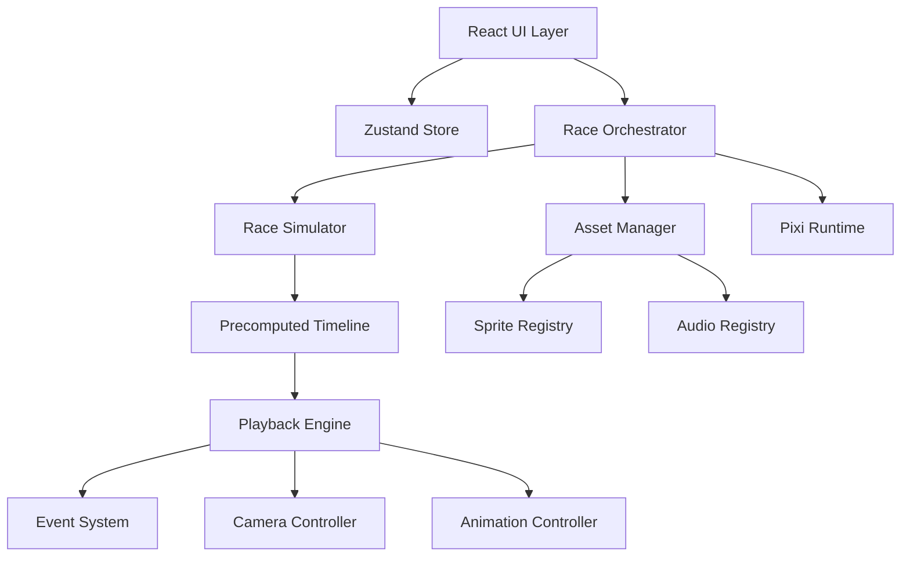

# Tech Lead Blueprint: Fun Racing Randomizer Game

## 1) Product Goal

Xây game đua xe vui nhộn chạy client-side với React 19 + TypeScript + Zustand + PixiJS.

Luồng cốt lõi:
1. Nhập danh sách racer từ textarea, mỗi dòng một tên.
2. Precompute toàn bộ kịch bản race trước khi chạy gồm winner, speed curve, random events.
3. Playback race theo timeline để người xem cảm giác ngẫu nhiên nhưng hợp lý.
4. Kết thúc race trả kết quả winner chắc chắn đúng theo kịch bản.

## 2) Runtime Constraints

- Max 30 racers.
- Không scroll track theo chiều dọc dù đông racer.
- Track length theo viewport, min 500px.
- Hỗ trợ 4 hướng đua: left-to-right, right-to-left, top-to-bottom, bottom-to-top.
- Có background image riêng và basic audio.
- Camera track leader, tự clamp gần vùng đích để không vượt viewport end.
- Minimap là tính năng mở rộng tùy chọn.

## 3) High-Level Architecture



## 4) Lifecycle Contract

```ts
export interface GameLifecycle {
  init(): Promise<void>
  loadAssets(): Promise<void>
  startRace(input: StartRaceInput): Promise<void>
  update(deltaMs: number): void
  render(): void
  onRaceEnd(result: RaceResult): void
}
```

Execution order:
1. init
2. loadAssets
3. startRace
4. update loop at ticker
5. render by Pixi scene graph
6. onRaceEnd callback and state finalize

## 5) Folder Structure

```text
src/
  app/
    App.tsx
    providers/
      GameProvider.tsx
  game/
    core/
      GameRuntime.ts
      RaceOrchestrator.ts
      GameClock.ts
    simulation/
      RaceSimulator.ts
      SpeedCurve.ts
      EventPlanner.ts
      SeededRng.ts
    playback/
      PlaybackEngine.ts
      RaceTimeline.ts
      RaceMath.ts
    rendering/
      PixiApp.ts
      SceneRoot.ts
      TrackRenderer.ts
      RacerRenderer.ts
      NameLabelRenderer.ts
      CameraController.ts
      MinimapRenderer.ts
    animation/
      AnimationController.ts
      AnimationStateMachine.ts
    assets/
      AssetManager.ts
      AssetValidator.ts
      AssetFallback.ts
      SpriteSheetFactory.ts
      CommunityAssetSchema.ts
    audio/
      AudioManager.ts
      SfxBus.ts
    state/
      raceStore.ts
      slices/
        configSlice.ts
        racersSlice.ts
        timelineSlice.ts
        playbackSlice.ts
        cameraSlice.ts
    types/
      race.ts
      asset.ts
      event.ts
      camera.ts
      animation.ts
    utils/
      clamp.ts
      lerp.ts
      easing.ts
      objectPool.ts
      perf.ts
```

## 6) Core TypeScript Types

```ts
export type RaceDirection = 'LTR' | 'RTL' | 'TTB' | 'BTT'

export interface RaceConfig {
  seed: string
  minDurationMs: number
  targetDurationMs: number
  trackLengthPx: number
  direction: RaceDirection
  eventDensity: number
  allowElimination: boolean
  maxRacers: number
}

export interface RacerInput {
  id: string
  name: string
  assetId?: string
}

export type RacerAnimState = 'idle' | 'running' | 'boost' | 'stunned' | 'lose' | 'win' | 'eliminated'

export interface RacerRuntimeState {
  racerId: string
  laneIndex: number
  progress01: number
  speedPxPerSec: number
  accelPxPerSec2: number
  isEliminated: boolean
  animState: RacerAnimState
  worldX: number
  worldY: number
}

export type RaceEventType = 'BOOST' | 'SLOW' | 'STUN' | 'ELIMINATE'

export interface RaceEvent {
  id: string
  type: RaceEventType
  racerId: string
  startMs: number
  durationMs: number
  magnitude: number
}

export interface TimelineKeyframe {
  tMs: number
  progress01: number
  speedPxPerSec: number
  activeEvents: string[]
}

export interface RacerTimeline {
  racerId: string
  keyframes: TimelineKeyframe[]
  finalRank: number
  finishMs: number
}

export interface PrecomputedScenario {
  seed: string
  winnerRacerId: string
  durationMs: number
  events: RaceEvent[]
  racerTimelines: Record<string, RacerTimeline>
}
```

## 7) Zustand State Model

```ts
export interface RaceStore {
  config: RaceConfig
  racers: RacerInput[]
  scenario: PrecomputedScenario | null

  playback: {
    phase: 'IDLE' | 'LOADING' | 'READY' | 'PLAYING' | 'PAUSED' | 'ENDED'
    elapsedMs: number
    timeScale: number
    winnerRacerId: string | null
  }

  camera: {
    worldX: number
    worldY: number
    zoom: number
    mode: 'LEADER_TRACK' | 'LOCKED_BY_MINIMAP'
    clampAtFinish: boolean
    focusRacerId: string | null
  }

  ui: {
    textareaInput: string
    errors: string[]
    warnings: string[]
  }

  actions: {
    setConfig(patch: Partial<RaceConfig>): void
    setRacersFromTextarea(raw: string): void
    setScenario(s: PrecomputedScenario): void
    startPlayback(): void
    pausePlayback(): void
    tick(deltaMs: number): void
    setCameraMode(mode: 'LEADER_TRACK' | 'LOCKED_BY_MINIMAP'): void
    lockCameraToRacer(racerId: string | null): void
    endRace(winnerRacerId: string): void
    resetRace(): void
  }
}
```

Store recommendations:
- Slices pattern cho config, racers, scenario, playback, camera.
- subscribeWithSelector để đồng bộ side-effect nặng như audio trigger, analytics.
- useShallow cho selector ghép object để giảm rerender UI.

## 8) Precompute Algorithm: winner guaranteed + duration guaranteed

### 8.1 Input
- racer list
- config duration
- seed

### 8.2 Steps
1. Parse racer list, trim empty, dedupe id.
2. Random chọn winner bằng seeded RNG.
3. Sinh finishTime cho từng racer:
   - Winner tại targetDurationMs.
   - Racer còn lại lớn hơn winner bằng offset random có giới hạn.
   - Nếu allowElimination thì một phần racer có finishMs là Infinity.
4. Chia timeline thành N segments, ví dụ 40-80 segment tùy duration.
5. Sinh base speed curve cho mỗi racer bằng noise mượt.
6. Inject event plan vào segment hợp lệ:
   - BOOST tăng speed tạm thời.
   - SLOW giảm speed.
   - STUN đặt speed thấp gần 0.
   - ELIMINATE khóa progress ở current.
7. Solve normalization:
   - Tính tích phân speed để ra progress.
   - Scale từng curve để match đúng finishTime đã định.
8. Post-process smoothing bằng cubic easing hoặc Hermite spline.
9. Build keyframe timeline cố định bước thời gian, ví dụ 100ms.
10. Validate invariants:
   - Winner về first.
   - Không racer vượt finish trước winner nếu không phải winner.
   - Tổng duration >= minDurationMs.

### 8.3 Formula suggestion
- progress:
  - p t+dt = clamp p t + v t * dt / trackLength
- speed blending:
  - v = baseV * eventMultiplier * fatigueFactor
- natural interpolation:
  - vSmooth = lerp vPrev vTarget alpha
  - alpha = 1 - exp negative k * dt

## 9) Event System Model

```ts
export interface EventEffect {
  speedMultiplier: number
  accelDelta: number
  forcedAnimState?: RacerAnimState
  canStack: boolean
}

export interface EventSystem {
  planEvents(input: {
    racers: RacerInput[]
    config: RaceConfig
    winnerRacerId: string
    rng: SeededRng
  }): RaceEvent[]

  applyEvents(atMs: number, racerState: RacerRuntimeState, events: RaceEvent[]): RacerRuntimeState
}
```

Event stacking rules:
- BOOST và SLOW có thể stack capped.
- STUN override movement ưu tiên cao hơn BOOST.
- ELIMINATE chuyển state terminal, disable mọi event khác sau timestamp.

## 10) Animation Controller

```ts
export interface SpriteAnimationDef {
  state: RacerAnimState
  frames: string[]
  fps: number
  loop: boolean
}

export interface RacerVisualProfile {
  profileId: string
  sharedAtlasId?: string
  animations: SpriteAnimationDef[]
  anchor: { x: number; y: number }
  scale: number
}

export interface AnimationController {
  bindRacer(racerId: string, profile: RacerVisualProfile): void
  setState(racerId: string, state: RacerAnimState): void
  update(deltaMs: number): void
}
```

State mapping gợi ý:
- idle khi READY
- running khi PLAYING bình thường
- boost khi active BOOST
- stunned khi active STUN
- win cho winner tại finish
- lose cho phần còn lại ở end
- eliminated khi ELIMINATE

## 11) Camera Controller + 4 directions + finish clamp

```ts
export interface CameraState {
  x: number
  y: number
  zoom: number
  mode: 'LEADER_TRACK' | 'LOCKED_BY_MINIMAP'
}

export interface CameraConfig {
  viewportWidth: number
  viewportHeight: number
  finishWorldCoord: number
  lookAheadPx: number
  clampMarginPx: number
}
```

Leader tracking logic:
1. Tìm racer progress cao nhất chưa eliminate.
2. Set target camera theo trục chính direction.
3. Áp dụng smoothing.
4. Clamp target để camera không vượt finish edge trừ margin.
5. Nếu mode LOCKED_BY_MINIMAP thì lấy focus từ minimap drag.

## 12) Renderer Rules

- Mỗi racer có container gồm body sprite + name label.
- Name label đặt phía trước racer theo trục đua:
  - LTR label ở bên phải
  - RTL label ở bên trái
  - TTB label ở dưới
  - BTT label ở trên
- Track length:
  - max viewportMainAxis và 500.
- Lane spacing:
  - viewportCrossAxis chia đều theo số racer.
- Có thể overlap, không cần tránh đè nhau theo yêu cầu.

## 13) Community Asset Upload Contract

### 13.1 Upload manifest

```json
{
  "manifestVersion": 1,
  "assetId": "dragon_01",
  "displayName": "Dragon Racer",
  "author": "community_user",
  "atlasImage": "dragon.png",
  "atlasData": "dragon.json",
  "animations": {
    "idle": { "frames": ["idle_0", "idle_1"], "fps": 6, "loop": true },
    "running": { "frames": ["run_0", "run_1", "run_2"], "fps": 12, "loop": true },
    "boost": { "frames": ["boost_0", "boost_1"], "fps": 16, "loop": true },
    "stunned": { "frames": ["stun_0", "stun_1"], "fps": 8, "loop": true },
    "win": { "frames": ["win_0", "win_1"], "fps": 10, "loop": false },
    "lose": { "frames": ["lose_0", "lose_1"], "fps": 10, "loop": false },
    "eliminated": { "frames": ["ko_0"], "fps": 1, "loop": false }
  },
  "defaultScale": 1,
  "anchor": { "x": 0.5, "y": 0.5 }
}
```

### 13.2 Validation pipeline
1. JSON schema validate required fields.
2. Verify atlas image and json loadable.
3. Verify all frames in manifest tồn tại trong atlas.
4. Verify all required animation states đủ.
5. Check fps range hợp lệ ví dụ 1-60.
6. Check texture size budget để tránh asset quá nặng.

### 13.3 Fallback strategy
- Nếu profile lỗi hoàn toàn dùng default built-in racer profile.
- Nếu thiếu 1 animation state, fallback sang running hoặc idle.
- Nếu atlas fail load, gán placeholder sprite màu.
- Log warning vào store.ui.warnings để hiển thị non-blocking.

## 14) Audio System

Basic channels:
- BGM race loop.
- SFX boost slow stun eliminate finish.

Rules:
- Preload audio ở loadAssets.
- Debounce spam SFX cùng loại trong cửa sổ ngắn.
- Mute on tab hidden nếu muốn tiết kiệm tài nguyên.

## 15) React to Pixi binding

```ts
export interface GameBridge {
  mount(canvasHost: HTMLDivElement): Promise<void>
  unmount(): void
  startRaceFromInput(rawNames: string): Promise<void>
  resize(width: number, height: number): void
}
```

Recommended flow:
- React quản lý form và control buttons.
- Pixi runtime giữ scene objects, ticker, textures.
- Zustand là single source of truth cho race state.
- Bridge subscribe store và apply delta ra Pixi.

## 16) Skeleton Code Snippets

### 16.1 GameRuntime

```ts
export class GameRuntime implements GameLifecycle {
  private lastTs = 0

  async init(): Promise<void> {
    // init pixi app, store listeners, resize hooks
  }

  async loadAssets(): Promise<void> {
    // preload base assets and selected community packs
  }

  async startRace(input: StartRaceInput): Promise<void> {
    // parse racers -> simulate scenario -> push to store -> start playback
  }

  update(deltaMs: number): void {
    // playbackEngine.update
    // animationController.update
    // cameraController.update
  }

  render(): void {
    // Pixi handles render, keep explicit for architecture clarity
  }

  onRaceEnd(result: RaceResult): void {
    // dispatch winner, stop race bgm, play finish sfx
  }
}
```

### 16.2 RaceSimulator

```ts
export class RaceSimulator {
  generateScenario(input: {
    racers: RacerInput[]
    config: RaceConfig
  }): PrecomputedScenario {
    // seeded rng
    // pick winner
    // build finish times
    // plan events
    // solve curves
    // build keyframes
    // validate
    return {} as PrecomputedScenario
  }
}
```

### 16.3 PlaybackEngine

```ts
export class PlaybackEngine {
  update(atMs: number, scenario: PrecomputedScenario): PlaybackFrame {
    // interpolate each racer keyframe
    // apply active events
    // produce renderable frame
    return {} as PlaybackFrame
  }
}
```

## 17) Performance Strategy for 60fps

- Reuse Pixi containers và text objects, tránh create destroy liên tục.
- Object pool cho event particles và transient effects.
- Hạn chế realloc arrays trong update loop.
- Fixed timestep simulation precompute, playback interpolation nhẹ.
- Dùng spritesheet atlas để giảm texture binds.
- Cache background và static track layer.
- Tách UI React rerender khỏi ticker 60fps.
- Chỉ sync store fields cần thiết cho React, phần realtime nằm trong runtime refs.
- Pause ticker hoặc giảm workload khi tab unfocus.

## 18) Edge Case Checklist

1. Chỉ 1 racer.
2. 2 racers tên trùng.
3. 30 racers với lane spacing dày và overlap.
4. Empty lines trong textarea.
5. Race duration nhỏ hơn min 10 giây phải auto clamp.
6. Resize liên tục trong lúc race.
7. Direction switch giữa các race liên tiếp.
8. Asset community thiếu frame running.
9. Asset json parse lỗi.
10. Atlas image tải chậm hoặc fail.
11. Tab unfocus rồi refocus.
12. Eliminate xảy ra với racer đang dẫn đầu.
13. Event chồng nhau boost + stun.
14. Winner bị stun cuối race nhưng vẫn phải thắng hợp lý theo timeline.
15. Seed giống nhau cho ra kết quả giống nhau.

## 19) Suggested Implementation Phases

Phase A
- Core store + input parser + seeded simulator + basic renderer rectangles.

Phase B
- Sprite animations per racer + event visual effects + audio.

Phase C
- Community asset upload + validation + fallback.

Phase D
- Minimap interaction lock camera + polish + QA.

## 20) Required Dependencies to add

- zustand
- pixi.js
- optional: howler for audio helper
- optional: zod for upload schema validation

This blueprint is implementation-ready for coding in next mode.
